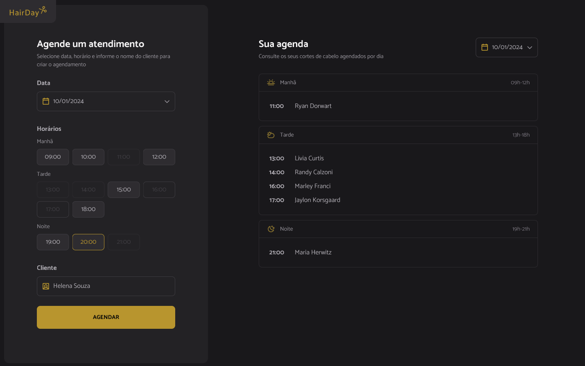

<h1 align="center"> Hair Day – Plataforma de Agendamentos</h1>

  
  
  
  
  
  

  Aplicação web para gerenciamento de agendamentos com organização por períodos do dia.

---

## 🖥️ Preview

  

---

## 📌 Sobre o Projeto

Hair Day é uma aplicação web de agendamento de serviços desenvolvida com foco em organização de código, modularização e boas práticas de JavaScript moderno.

A plataforma permite criar, visualizar e remover agendamentos, agrupando automaticamente os horários por:

- ☀️ Manhã  
- 🌤️ Tarde  
- 🌙 Noite  

O projeto aplica conceitos fundamentais de integração entre frontend e API simulada, utilizando JSON Server como backend mockado.

---

## 🧠 Funcionalidades

✔️ Cadastro de agendamentos  
✔️ Agrupamento automático por período do dia  
✔️ Exclusão de agendamentos  
✔️ Persistência de dados com JSON Server  
✔️ Manipulação de datas com dayjs  
✔️ Interface organizada e responsiva  
✔️ Estrutura modular com Webpack  

---

## 🛠️ Tecnologias Utilizadas

| Tecnologia | Finalidade |
|------------|------------|
|  HTML5 | Estruturação semântica da aplicação |
|  CSS3 | Estilização e layout responsivo |
|  JavaScript | Lógica da aplicação e manipulação do DOM |
|  Webpack | Bundler para modularização e build do projeto |
|  JSON Server | Simulação de API REST para persistência de dados |
| 📅 dayjs | Manipulação e formatação de datas |

---

## 🧠 O que Aprendi com esse Projeto

- ✔️ Aplicar lógica de JavaScript para criar, remover e agrupar dados  
- ✔️ Trabalhar com bundler (Webpack) e organizar módulos  
- ✔️ Integrar frontend com uma API simulada usando JSON Server  
- ✔️ Manipular datas com a biblioteca dayjs  
- ✔️ Criar uma interface funcional e responsiva utilizando HTML e CSS  